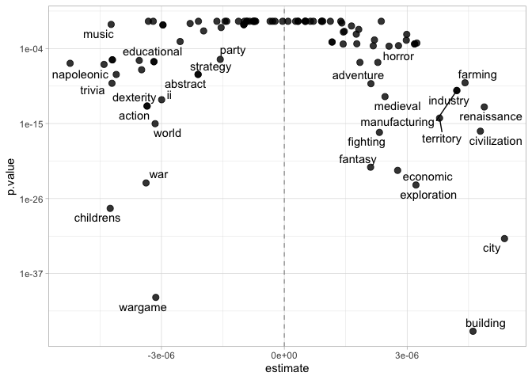
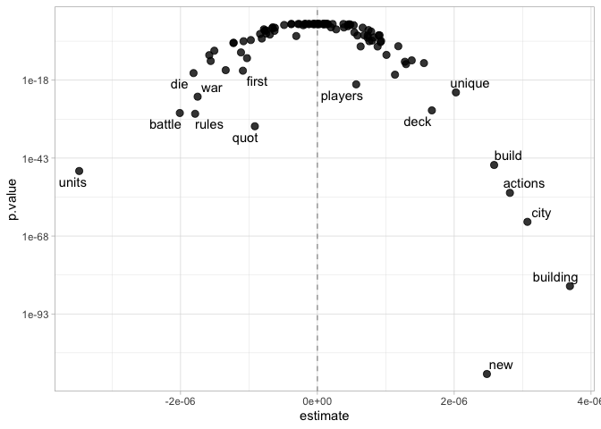

Board Games
================
Justin Arends
2022-09-24

``` r
knitr::opts_chunk$set(echo = TRUE, message = FALSE, warning = FALSE)
library(tidyverse)


details <- read_csv("games_detailed_info.csv")%>% janitor::clean_names()
```

# Preparing the Data

**The Goal** \>\> Can we predict how many board games we can sell based
on the data elements we have. As a business, it would be important for
us to know what variables of interest drive sales for our customers as
we go about creating new board games.

I’m going to clean up the data and create some factor variables. I’m
going to combine the two columns from the game details `Owned` and
`Trading.` From what little information I could find, I think it is safe
to assume that the combination of these two indicate the total games
purchased.

I’ll also be creating a factor variable where I have cut the `Total`
games sold into roughly equal size groups. This grouping will be used in
the next step to determine what board game categories and what board
game descriptions are likely to result in more sales.

``` r
clean_details <- 
  details %>%
  select(id, minplayers, maxplayers,
         boardgamecategory, description,
         playingtime, minage, owned, trading) %>%
  mutate(total = owned + trading) %>%
  mutate(total_cuts = cut(total, breaks = c(0, 150, 500, 1000,
                                            Inf),
                          include.lowest= T,
                          labels = c("150", "500", "1000", "200000")
                          ),
         ) %>%
  mutate(boardgamecategory = gsub("[[:punct:]]", "", boardgamecategory))  


clean_details %>% 
  count(total_cuts) 
```

    ## # A tibble: 4 × 2
    ##   total_cuts     n
    ##   <fct>      <int>
    ## 1 150         5140
    ## 2 500         8015
    ## 3 1000        3295
    ## 4 200000      5181

## Getting board category words (feature selection)

The goal here is to understand if the words used to describe the board
game (in the `boardcategory` column) are related to to the total number
of games sold

Here are the word counts for the words used in the Board Game Category:

``` r
library(tidytext)

details_tidy <- 
  clean_details %>%
  unnest_tokens(word, boardgamecategory) %>%
  anti_join(get_stopwords()) %>%
  filter(word != "game") %>%
  mutate(word = gsub("[[:punct:]]", "", word))


details_tidy %>%
  count(word, sort = TRUE)  
```

    ## # A tibble: 104 × 2
    ##    word          n
    ##    <chr>     <int>
    ##  1 card       6402
    ##  2 wargame    3820
    ##  3 fantasy    2681
    ##  4 war        1996
    ##  5 party      1968
    ##  6 dice       1847
    ##  7 fiction    1666
    ##  8 science    1666
    ##  9 fighting   1658
    ## 10 childrens  1635
    ## # … with 94 more rows

Now that we have the word counts, let’s go ahead and focus on the top
100 words used. With these top 100 words, we’re going to look at, by
`total_cuts`, how many words were used, how many time the Top 100 word
was used, and find the percentage of how many times that word was used
overall. This essentially is a term frequency matrix of sorts.

This information will be used to model the relationship between the word
and the `total_cuts` variable.

``` r
top_words <-
  details_tidy %>%
  count(word, sort = TRUE) %>%
  slice_max(n, n = 100) %>%
  pull(word)


word_freqs <-
  details_tidy %>%
  count(word, total_cuts) %>%
  complete(word, total_cuts, fill = list(n = 0)) %>%
  group_by(total_cuts) %>%
  mutate(
    total = sum(n),
    proportion = n / total
  ) %>%
  ungroup() %>%
  filter(word %in% top_words) %>%
  # Need to turn the total_cuts into a numeric data for prediction
  mutate(total_cuts = as.numeric(as.character(total_cuts)))


word_freqs
```

    ## # A tibble: 400 × 5
    ##    word     total_cuts     n total proportion
    ##    <chr>         <dbl> <int> <int>      <dbl>
    ##  1 abstract        150   564 16166    0.0349 
    ##  2 abstract        500   524 26783    0.0196 
    ##  3 abstract       1000   171 11249    0.0152 
    ##  4 abstract     200000   286 18694    0.0153 
    ##  5 action          150   394 16166    0.0244 
    ##  6 action          500   369 26783    0.0138 
    ##  7 action         1000   163 11249    0.0145 
    ##  8 action       200000   164 18694    0.00877
    ##  9 adult           150    39 16166    0.00241
    ## 10 adult           500    60 26783    0.00224
    ## # … with 390 more rows

### Build a model for words and the total owned

In this step, we’re going to nest our data into sub-datasets by
`total_cuts`. Essentially, we’re going to create a dataset of just the
`total_cuts` = 150, `total_cuts` = 500, etc.

The numbers from our prior table will be used in a logistic regression,
where we’re going to consider the `n` value to be the total number of
successes and we’re going to consider the `total` value to be the total
number of attempts.

``` r
word_mods <-
  word_freqs %>%
  nest(data = c(total_cuts, n, total, proportion)) %>%
  mutate(
    model = map(data, ~ glm(cbind(n, total) ~ total_cuts, ., family = "binomial")),
    model = map(model, tidy)
  ) %>%
  unnest(model) %>%
  filter(term != "(Intercept)") %>%
  mutate(p.value = p.adjust(p.value))  %>%
  arrange(-estimate)

word_mods 
```

    ## # A tibble: 100 × 7
    ##    word          data             term         estimate std.e…¹ stati…²  p.value
    ##    <chr>         <list>           <chr>           <dbl>   <dbl>   <dbl>    <dbl>
    ##  1 city          <tibble [4 × 4]> total_cuts 0.00000538 4.38e-7   12.3  1.35e-32
    ##  2 renaissance   <tibble [4 × 4]> total_cuts 0.00000488 6.19e-7    7.89 2.70e-13
    ##  3 civilization  <tibble [4 × 4]> total_cuts 0.00000479 5.41e-7    8.86 7.56e-17
    ##  4 building      <tibble [4 × 4]> total_cuts 0.00000461 3.16e-7   14.6  3.44e-46
    ##  5 farming       <tibble [4 × 4]> total_cuts 0.00000441 6.51e-7    6.78 9.65e-10
    ##  6 industry      <tibble [4 × 4]> total_cuts 0.00000421 5.89e-7    7.15 7.03e-11
    ##  7 manufacturing <tibble [4 × 4]> total_cuts 0.00000421 5.89e-7    7.15 7.03e-11
    ##  8 territory     <tibble [4 × 4]> total_cuts 0.00000379 4.54e-7    8.35 6.32e-15
    ##  9 environmental <tibble [4 × 4]> total_cuts 0.00000324 7.37e-7    4.39 6.40e- 4
    ## 10 exploration   <tibble [4 × 4]> total_cuts 0.00000321 3.00e-7   10.7  9.76e-25
    ## # … with 90 more rows, and abbreviated variable names ¹​std.error, ²​statistic

Plot the model results

``` r
library(ggrepel)


word_mods %>%
  ggplot(aes(estimate, p.value)) +
  theme_light()+
  geom_vline(xintercept = 0, 
             lty = 2, 
             alpha = 0.7, 
             color = "gray50") +
  geom_point(alpha = 0.8, size = 2.5) +
  scale_y_log10() +
  geom_text_repel(aes(label = word), max.overlaps = 5)
```

<!-- -->

Based on the game’s description, words like new, building, city,
exploration increase are associated with more sold games.

Words like wargame, childrens, war, napoleonic are less likely to be
associated with sold games.

With that information known, let’s save the top 10 words positively
associated with sales and the bottom 10 words associated with sales. The
idea being that if a board game is categorized with the “bottom 10
words,” it’s likely to not sell a lot of games.

``` r
category_higher_words <-
  word_mods %>%
  filter(p.value < 0.05) %>%
  slice_max(estimate, n = 10) %>%
  pull(word)

category_lower_words <-
  word_mods %>%
  filter(p.value < 0.05) %>%
  slice_max(-estimate, n = 10) %>%
  pull(word)


category_higher_words
```

    ##  [1] "city"          "renaissance"   "civilization"  "building"     
    ##  [5] "farming"       "industry"      "manufacturing" "territory"    
    ##  [9] "environmental" "exploration"

``` r
category_lower_words
```

    ##  [1] "napoleonic" "civil"      "childrens"  "trivia"     "modern"    
    ##  [6] "warfare"    "memory"     "sports"     "racing"     "war"

## Getting **description** words (feature selection)

The goal here is to understand if the words used to describe the board
game (in the `description` column) are related to to the total number of
games sold.

All the steps above are repeated here, but with a different text column.

Top words used in the description:

``` r
library(tidytext)

description_tidy <- 
  clean_details %>%
  unnest_tokens(word, description) %>%
  anti_join(get_stopwords()) %>%
  # Removing this word since they're all "games"
  filter(word != "game") %>%
  filter(!str_detect(word, "\\d")) %>%
  mutate(word = gsub("[[:punct:]]", "", word)) 


description_tidy %>%
  count(word, sort = TRUE)  
```

    ## # A tibble: 69,400 × 2
    ##    word        n
    ##    <chr>   <int>
    ##  1 players 34960
    ##  2 player  30307
    ##  3 cards   29419
    ##  4 quot    25456
    ##  5 one     23356
    ##  6 can     20062
    ##  7 card    19199
    ##  8 play    13122
    ##  9 two     11239
    ## 10 points  11180
    ## # … with 69,390 more rows

``` r
description_top_words <-
  description_tidy %>%
  count(word, sort = TRUE) %>%
  slice_max(n, n = 100) %>%
  pull(word)


description_word_freqs <-
  description_tidy %>%
  count(word, total_cuts) %>%
  complete(word, total_cuts, fill = list(n = 0)) %>%
  group_by(total_cuts) %>%
  mutate(
    total = sum(n),
    proportion = n / total
  ) %>%
  ungroup() %>%
  filter(word %in% description_top_words) %>%
  # Need to turn the total_cuts into a numeric data for prediction
  mutate(total_cuts = as.numeric(as.character(total_cuts)))


description_word_freqs
```

    ## # A tibble: 400 × 5
    ##    word    total_cuts     n  total proportion
    ##    <chr>        <dbl> <int>  <int>      <dbl>
    ##  1 action         150   824 477556    0.00173
    ##  2 action         500  1242 816139    0.00152
    ##  3 action        1000   700 384265    0.00182
    ##  4 action      200000  1384 650587    0.00213
    ##  5 actions        150   516 477556    0.00108
    ##  6 actions        500   911 816139    0.00112
    ##  7 actions       1000   557 384265    0.00145
    ##  8 actions     200000  1348 650587    0.00207
    ##  9 also           150  1389 477556    0.00291
    ## 10 also           500  2254 816139    0.00276
    ## # … with 390 more rows

### Build a model for words and the total owned

``` r
description_word_mods <-
  description_word_freqs %>%
  nest(data = c(total_cuts, n, total, proportion)) %>%
  mutate(
    model = map(data, ~ glm(cbind(n, total) ~ total_cuts, ., family = "binomial")),
    model = map(model, tidy)
  ) %>%
  unnest(model) %>%
  filter(term != "(Intercept)") %>%
  mutate(p.value = p.adjust(p.value))  %>%
  arrange(-estimate)

description_word_mods 
```

    ## # A tibble: 100 × 7
    ##    word     data             term         estimate   std.error stati…¹   p.value
    ##    <chr>    <list>           <chr>           <dbl>       <dbl>   <dbl>     <dbl>
    ##  1 building <tibble [4 × 4]> total_cuts 0.00000369 0.000000187   19.7  8.46e- 85
    ##  2 city     <tibble [4 × 4]> total_cuts 0.00000307 0.000000179   17.2  3.53e- 64
    ##  3 actions  <tibble [4 × 4]> total_cuts 0.00000281 0.000000177   15.9  7.00e- 55
    ##  4 build    <tibble [4 × 4]> total_cuts 0.00000258 0.000000178   14.5  6.17e- 46
    ##  5 new      <tibble [4 × 4]> total_cuts 0.00000248 0.000000109   22.8  5.58e-113
    ##  6 unique   <tibble [4 × 4]> total_cuts 0.00000202 0.000000198   10.2  1.17e- 22
    ##  7 deck     <tibble [4 × 4]> total_cuts 0.00000167 0.000000146   11.5  2.00e- 28
    ##  8 power    <tibble [4 × 4]> total_cuts 0.00000156 0.000000198    7.87 2.96e- 13
    ##  9 ndash    <tibble [4 × 4]> total_cuts 0.00000138 0.000000181    7.61 2.19e- 12
    ## 10 tiles    <tibble [4 × 4]> total_cuts 0.00000130 0.000000163    7.97 1.36e- 13
    ## # … with 90 more rows, and abbreviated variable name ¹​statistic

Plot the model results

``` r
library(ggrepel)


description_word_mods %>%
  ggplot(aes(estimate, p.value)) +
  theme_light()+
  geom_vline(xintercept = 0, 
             lty = 2, 
             alpha = 0.7, 
             color = "gray50") +
  geom_point(alpha = 0.8, size = 2.5) +
  scale_y_log10() +
  geom_text_repel(aes(label = word), max.overlaps = 5)
```

<!-- -->

Based on the game’s description, words like new, building, city, actions
are likely to lead to more board games sold.

Words like units, battles, rules, die are less likely to lead to more
board games sold.

Again, we’ll save the top 10 and bottom 10 description words.

``` r
description_higher_words <-
  description_word_mods %>%
  filter(p.value < 0.05) %>%
  slice_max(estimate, n = 10) %>%
  pull(word)

description_lower_words <-
  description_word_mods %>%
  filter(p.value < 0.05) %>%
  slice_max(-estimate, n = 10) %>%
  pull(word)


description_higher_words
```

    ##  [1] "building" "city"     "actions"  "build"    "new"      "unique"  
    ##  [7] "deck"     "power"    "ndash"    "tiles"

``` r
description_lower_words
```

    ##  [1] "units"  "battle" "die"    "rules"  "war"    "side"   "combat" "roll"  
    ##  [9] "s"      "pieces"

# Model

Need to transform the `total` variable to as it is right-skewed and
creating a more normal distribution. To do this, I’m going to take the
`log10()` of our total variable.

What I’m now doing in the below is creating some “Yes/No” variables
relating to the board game categories and the board game description.
Essentially, if the board game category is in one of the “top high”
category words, we’re going to return a “yes” value. If it doesn’t, it’s
a no. We’re going to do the same thing for the description as well from
the information above.

``` r
category_higher_pat <- glue::glue_collapse(category_higher_words, sep = "|")
category_lower_pat <- glue::glue_collapse(category_lower_words, sep = "|")
description_higher_pat <- glue::glue_collapse(description_higher_words, sep = "|")
description_lower_pat <- glue::glue_collapse(description_lower_words, sep = "|")

lm.data <- 
  clean_details %>% 
  mutate_if(is.character, str_to_lower) %>%
  mutate(total = log10(total+1),
         cat_high = str_detect(boardgamecategory, category_higher_pat) |> as.numeric(),
         cat_low = str_detect(boardgamecategory, category_lower_pat) |> as.numeric(),
         desc_high = str_detect(description, description_higher_pat) |> as.numeric(),
         desc_low = str_detect(description, description_lower_pat) |> as.numeric()) %>%
  replace_na(list(cat_high = 0, cat_low= 0,
                  desc_high = 0, desc_low = 0)) %>%
  mutate(cat_high = as.factor(cat_high),
         cat_low = as.factor(cat_low),
         desc_high = as.factor(desc_high),
         desc_low = as.factor(desc_low))

lm.model <- lm(total ~ minplayers + maxplayers + cat_high + cat_low + desc_high + desc_low + playingtime + minage,  
                data =lm.data)

summary(lm.model)
```

    ## 
    ## Call:
    ## lm(formula = total ~ minplayers + maxplayers + cat_high + cat_low + 
    ##     desc_high + desc_low + playingtime + minage, data = lm.data)
    ## 
    ## Residuals:
    ##      Min       1Q   Median       3Q      Max 
    ## -2.99736 -0.39757 -0.07107  0.32780  2.58990 
    ## 
    ## Coefficients:
    ##               Estimate Std. Error t value Pr(>|t|)    
    ## (Intercept)  2.164e+00  5.684e-01   3.807 0.000141 ***
    ## minplayers  -3.818e-02  5.711e-03  -6.685 2.37e-11 ***
    ## maxplayers   2.242e-05  2.568e-04   0.087 0.930424    
    ## cat_high1    2.126e-01  1.157e-02  18.379  < 2e-16 ***
    ## cat_low1    -7.593e-02  8.343e-03  -9.100  < 2e-16 ***
    ## desc_high1   1.736e-01  8.262e-03  21.012  < 2e-16 ***
    ## desc_low1    1.422e-01  5.682e-01   0.250 0.802395    
    ## playingtime  2.421e-05  7.268e-06   3.331 0.000867 ***
    ## minage       2.977e-02  1.080e-03  27.566  < 2e-16 ***
    ## ---
    ## Signif. codes:  0 '***' 0.001 '**' 0.01 '*' 0.05 '.' 0.1 ' ' 1
    ## 
    ## Residual standard error: 0.5681 on 21622 degrees of freedom
    ## Multiple R-squared:  0.09731,    Adjusted R-squared:  0.09697 
    ## F-statistic: 291.3 on 8 and 21622 DF,  p-value: < 2.2e-16

From these model results

-   As the minimum number of players required to play increases, it has
    a negative relationship against total sales
-   We can see that the feature engingeering we did earlier with trying
    to understand what words are the best to use have impacts that we
    would expect
